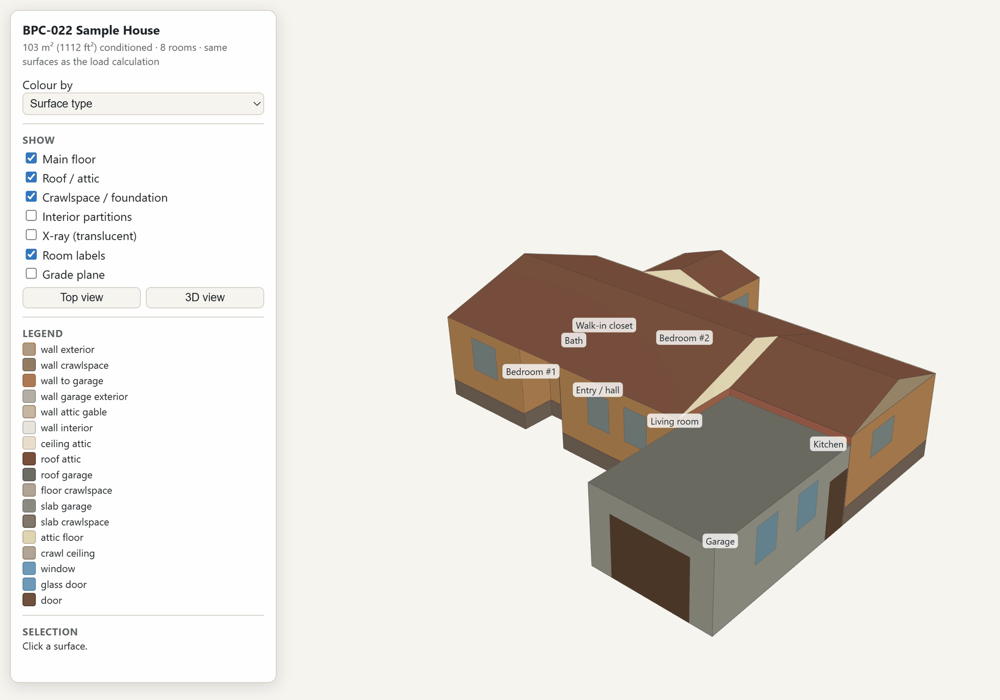
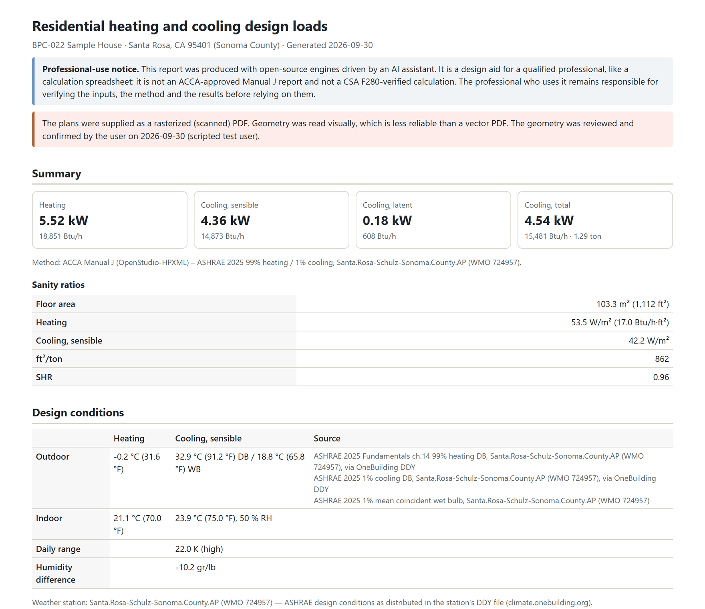
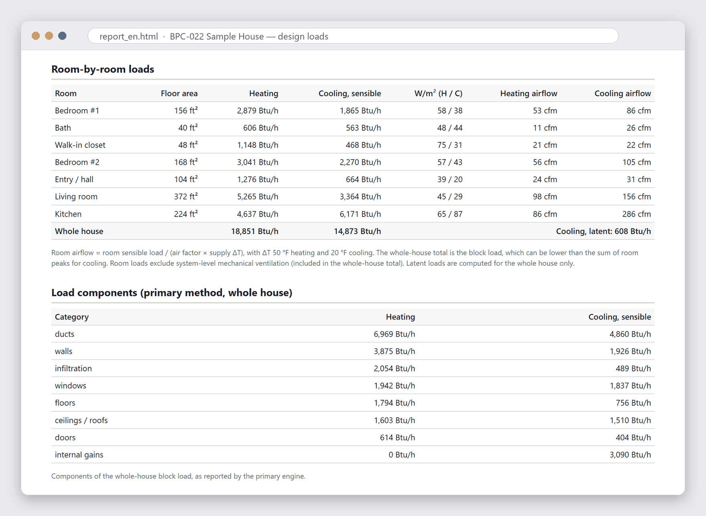
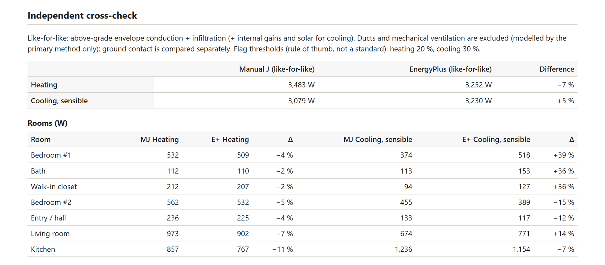
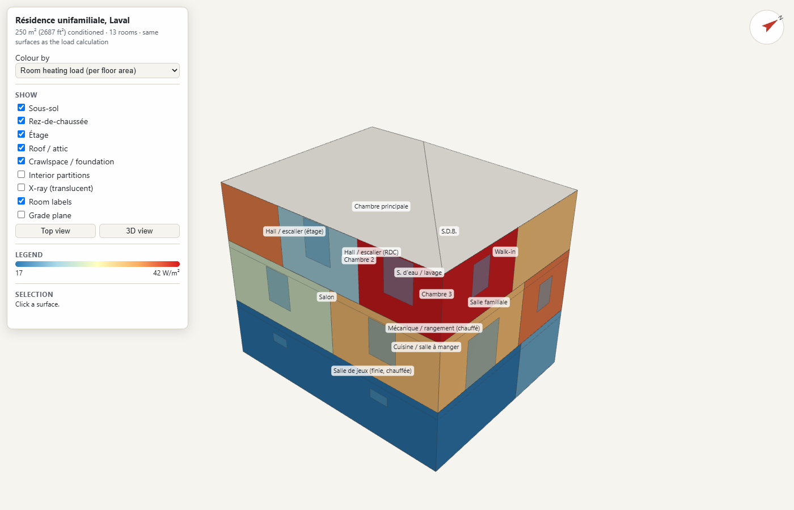
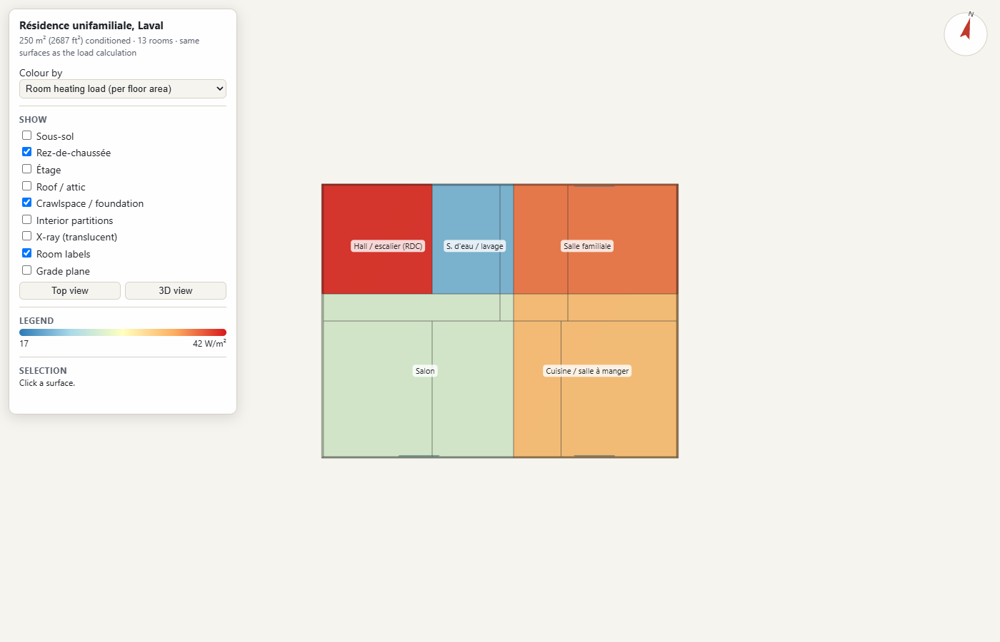

# hvac-loads-skill

A [Claude Code](https://claude.com/claude-code) skill that turns house plans (vector or scanned PDF) into **auditable room-by-room heating and cooling design loads**, using open-source engines. It also produces an **interactive 3D model of the exact surfaces used in the calculation**.

> **Professional-use notice.** This is a design aid for qualified professionals, like a calculation spreadsheet. It is **not** an ACCA-approved Manual J report and **not** a CSA F280-verified calculation. The professional using it remains responsible for the inputs, the method and the results.



## What it does

```
plans.pdf ──► takeoff (Claude reads the plans; tools calibrate, crop, measure) ──► building.json
                                                                                  │  QA gates + your confirmation
                                                                                  ▼
                               typed surfaces (walls, windows, slabs, attic, crawlspace, garage…)
                     ┌───────────────────────────────┼───────────────────────────────┐
                     ▼                               ▼                               ▼
      ACCA Manual J procedures          EnergyPlus design-day heat balance     3D viewer + takeoff CSV
      via OpenStudio-HPXML (primary)    one zone per room (independent check)  (same surfaces)
                     └──────────────► comparison + report (EN/FR, PDF) ◄──────┘
```

- **Plan reading.**
  - Vector PDFs: lines, curves and dimension text, including metric and vertical text.
  - Scanned PDFs: gridded crops and line finding. A scanned PDF triggers an up-front accuracy warning.
  - Scale is calibrated on dimension strings, with a second-axis check; printed scale notes are never trusted.
- **QA gates.**
  - Dimension chains must add up.
  - Modelled areas are reconciled with the whole-house, per-level and per-room areas printed on the plans.
  - The model is drawn over the plan pages, and 3D/top-view previews are produced.
  - **You confirm the geometry before any load is calculated.**
- **Interview.** Claude asks only what the plans don't show, offering a default and its source each time. For Canadian sites it asks whether you want CSA F280 applied with your own copy of the standard.
- **Design conditions.** ASHRAE design days from the nearest weather station, or NBC Appendix C values for Canadian municipalities, or your own data. They are always explicit and cited.
- **Two methods.** OpenStudio-HPXML's Manual J implementation is the primary result. An EnergyPlus model built to fail differently cross-checks it room by room, like for like. Disagreements are flagged and must be explained.
- **Deliverables.**
  - an English or French report (HTML/PDF), with every input's source, the QA results and the method comparison;
  - `model3d.html`;
  - `takeoff.csv`: areas, U-values and UA per surface;
  - `results.json`.

## Example: a scanned sample house

A fresh Claude Code session ran the skill on the BPC-022 sample house published by Permit Sonoma: a scanned 4-page plan set (not included here), sited in Santa Rosa, CA. The interview answers were scripted for the test. It took about 21 minutes from PDF to report.

- **Scale.** The printed scale (1/4" = 1'-0") did not match the dimension strings, so the skill calibrated on the dimensions instead.
- **Areas.** Glazing (158 ft²) and garage (280 ft²) matched the plans exactly. The conditioned area is 1,112 ft² modelled vs 1,136 ft² printed; the difference is the recessed porch.
- **Ducts.** Ducts in the vented attic account for 37% of the heating load.





The EnergyPlus model agrees with the Manual J result within −7% for heating and +5% for sensible cooling, compared like for like. Room-level cooling differences are larger in the small rooms, but stay under the 150 W absolute threshold for a flag.



The synthetic vector plan set in `tests/fixtures/laval` (French, metric, three levels), with rooms coloured by design heating load per floor area:

| 3D view | Top view, ground floor |
|---|---|
|  |  |

Click any surface in the viewer to see its area, U-value, assembly, orientation and the room's loads.

## Install

Requirements:
- [uv](https://docs.astral.sh/uv/);
- internet access on first use, to download the engines (~350 MB) and weather data;
- Edge or Chrome, optional, for PDF reports and PNG previews.

Developed and tested on Windows 11. The pinned engines are also published for macOS and Linux, but those platforms are untested.

As a Claude Code plugin:

```
/plugin marketplace add vinnividivicci/hvac-loads-skill
/plugin install hvac-loads@hvac-loads-skill
```

Or copy `skills/hvac-load-calc` into `~/.claude/skills/`.

Then just ask, for example: *"Here are my plans: C:\…\house.pdf. The house will be built in Laval, Québec. I need room-by-room heating and cooling loads."* On first use the skill installs and verifies the pinned engines (OpenStudio 3.11.0 with EnergyPlus 25.2, and OpenStudio-HPXML v1.12.0) into `~/.hvacload`. No admin rights are needed.

The skill's command-line tools (`uv run scripts/hvacload.py <command>`, `-h` for options) can also be used directly:

| Command | Purpose |
|---|---|
| `setup`, `doctor`, `selftest` | Download, check and verify the pinned engines |
| `init`, `clone` | New project from a PDF; what-if copy |
| `pdf-info`, `pdf-render`, `pdf-profile`, `pdf-vectors`, `pdf-measure` | Classify pages; gridded crops; find lines on scans; vector geometry and text; calibration with a second-axis check |
| `weather`, `nbc` | ASHRAE design days from the nearest station; NBC Table C-2 values for Canadian municipalities |
| `assembly` | Effective R-value of framed assemblies |
| `check [--geometry-only]`, `overlay`, `preview-png` | QA gates, model drawn over the plans, 3D and top-view PNGs |
| `run --lang en/fr --pdf` | Both engines, cross-check, report, 3D model, takeoff CSV |

## Accuracy and validation

- `selftest` reproduces OpenStudio-HPXML's ACCA reference case exactly, for heating and sensible cooling.
- **Like-for-like cross-check on the reference houses:** heating within ±7%; cooling mostly within ±6%. Cool-summer Quebec houses show larger cooling differences, which are flagged and explained (solar timing on walls and windows).
- **End-to-end runs** by fresh Claude sessions:
  - a scanned sample house ([example above](#example-a-scanned-sample-house)): glazing area reconciled exactly;
  - a synthetic vector plan set (`tests/fixtures/laval`): the takeoff matched the ground-truth model exactly, and the run caught a mis-printed scale and an inconsistent dimension chain.

See [docs/design.md](docs/design.md) for the method, the design decisions, the validation details and cited background.

**Limitations.**
- Latent loads are whole-house only.
- No equipment selection (Manual S) or duct design (Manual D) yet.
- No exterior shading yet.
- Roof valleys are simplified, and split-level adjacencies are treated conservatively.
- Opening the 3D viewer needs internet access (three.js from a CDN).

See the [roadmap](docs/roadmap.md).

## Standards, data and licensing

- **No standards text is included.** CSA F280, ACCA Manual J, ASHRAE and ICC documents are copyrighted; the skill cites clause numbers only. If you own CSA F280, you may give it to Claude for your own project; the skill never stores it.
- **Engines are downloaded at run time** from their official releases and not redistributed: OpenStudio, EnergyPlus and OpenStudio-HPXML (BSD-style licenses with trademark clauses). This project is not affiliated with or endorsed by their authors.
- **Weather and code data are fetched at run time:** [climate.onebuilding.org](https://climate.onebuilding.org) station files (please cite them) and the free NBC PDF from the NRC Publications Archive.
- **Python dependencies** are all permissive (MIT, BSD or Apache-2.0): numpy, shapely, pdfplumber and pdfminer.six, pypdfium2, pillow, openpyxl. The 3D viewer loads three.js (MIT).
- This repository is released under the [MIT License](LICENSE).

## Development

```bash
uv run --group dev pytest        # unit tests; engine integration tests run when the engines are installed
uv run skills/hvac-load-calc/scripts/hvacload.py run skills/hvac-load-calc/examples/two-room   # example run
uv run tests/fixtures/laval/make_plans.py plans.pdf     # regenerate the synthetic vector plan set
```

Issues and pull requests are welcome, especially new reference houses with known results.
